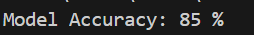
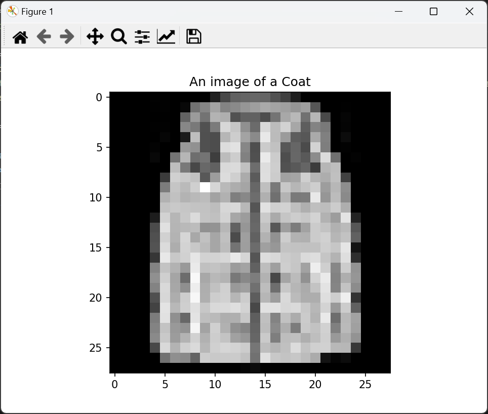
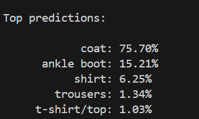

# Contrastive Language-Image Pre-training (CLIP)

This repository contains the implementation and exploration of CLIP, a model that learns visual concepts from natural language descriptions.

## Overview
CLIP leverages a contrastive training approach where an image encoder and a text encoder are jointly trained to match image-text pairs.

## Features
- Implementation of image and text encoders
- Transformer-based architectures
- Multi-modal embeddings and alignment

## Setup
To run this project, clone the repository and install the necessary dependencies:
```bash
git clone https://github.com/uddithmachiraju/Contrastive-Language-Image-Pre-training-CLIP.git
cd Contrastive-Language-Image-Pre-training-CLIP
python train.py```

## Model Accuracy and Results

### Accuracy Plot

)

The plot above shows the training and validation accuracy over the epochs.

### Sample Predictions


) 

The image above illustrates the model's predictions on test samples. The model successfully identifies and matches the images with their respective descriptions.


